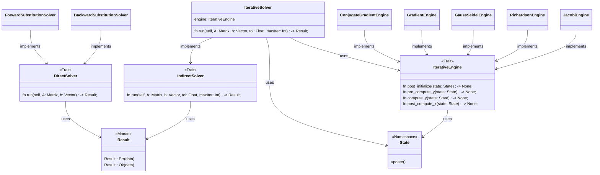

## Guidelines

Some notes about the graphic language to adopt when using Mermaid diagrams:

- If something should be done (now or in the future), mark it with todo.

- If something has been quirkly implemented, mark it with alpha.

- If something has been refined, mark it with beta.

- If something has been tested and is ready for staging, mark it with staging.

- If something has been shipped, mark it with done.

## Class Diagram

